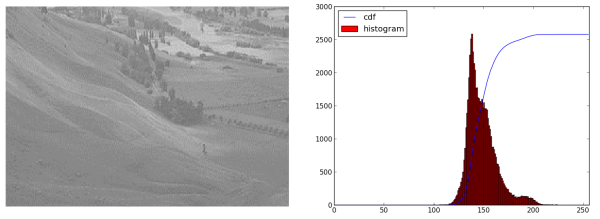
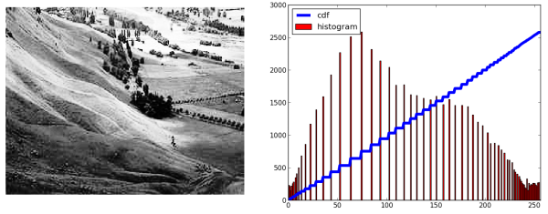
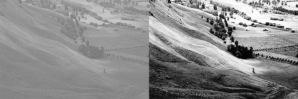

.. _Histogram_Equalization:

Histograms - 2: Histogram Equalization
****************************************

Goal
======

Here you will learn concepts about histogram equalization and improve the contrast of your image.

Theory
=========

Consider an image whose pixel values are confined to some specific range of values only. For eg, brighter image will have all pixels confined to high values. But a good image will have pixels from all regions of the image. So you need to stretch this histogram to either ends (as given in below image, from wikipedia) and that is what Histogram Equalization does (in simple words). This normally improves the contrast of the image.

    .. image:: images/histogram_equalization.png
        :alt: Histograms Equalization 
        :align: center   

I would recommend you to read the wikipedia page on `Histogram Equalization <http://en.wikipedia.org/wiki/Histogram_equalization>`_ for more details about it. It has a very good explanation with worked out examples, so that you would understand almost everything after reading that. Instead, here we will see its Numpy implementation. After that, we will see OpenCV function.
::

    import cv2
    import numpy as np
    from matplotlib import pyplot as plt
     
    img = cv2.imread('wiki.jpg',0)
     
    hist,bins = np.histogram(img.flatten(),256,[0,256])
     
    cdf = hist.cumsum()
    cdf_normalized = cdf * hist.max()/ cdf.max()
     
    plt.plot(cdf_normalized, color = 'b')
    plt.hist(img.flatten(),256,[0,256], color = 'r')
    plt.xlim([0,256])
    plt.legend(('cdf','histogram'), loc = 'upper left')
    plt.show()
    

You can see histogram lies in brighter region. We need the full spectrum. For that, we need a transformation function which maps the input pixels in brighter region to output pixels in full region. That is what histogram equalization does.

Now we find the minimum histogram value (excluding 0) and apply the histogram equalization equation as given in wiki page. But I have used here, the masked array concept array from Numpy. For masked array, all operations are performed on non-masked elements. You can read more about it from Numpy docs on masked arrays.
::

    cdf_m = np.ma.masked_equal(cdf,0)
    cdf_m = (cdf_m - cdf_m.min())*255/(cdf_m.max()-cdf_m.min())
    cdf = np.ma.filled(cdf_m,0).astype('uint8') 
    
Now we have the look-up table that gives us the information on what is the output pixel value for every input pixel value. So we just apply the transform.
::

    img2 = cdf[img] 
    
Now we calculate its histogram and cdf as before ( you do it) and result looks like below :

    
Another important feature is that, even if the image was a darker image (instead of a brighter one we used), after equalization we will get almost the same image as we got. As a result, this is used as a "reference tool" to make all images with same light conditions. This is useful in many cases, for eg, in face recognition, before training the face data, the images of faces are histogram equalized to make them all with same light conditions.

Histograms Equalization in OpenCV
===================================

OpenCV has a function to do this, **cv2.calcHist()**. Its input is just grayscale image and output is our image.

Below is a simple code snippet showing its usage for same image we used :
::

    img = cv2.imread('wiki.jpg',0)
    equ = cv2.equalizeHist(img)
    res = np.hstack((img,equ)) #stacking images side-by-side
    cv2.imwrite('res.png',res)

    
So now you can take different images with different light conditions, equalize it and check the results.

Histogram equalization is good when histogram of the image is confined to a particular region. It won't work good in places where there is large intensity variations where histogram covers a large region, ie both bright and dark pixels are present. Please check the SOF links in Additional Resources.

Additional Resources
======================
1. wikipedia page on `Histogram Equalization <http://en.wikipedia.org/wiki/Histogram_equalization>`_
2. `Masked Arrays in Numpy <http://docs.scipy.org/doc/numpy/reference/maskedarray.html>`_

Also check these SOF questions regarding contrast adjustment:

3. `How can I adjust contrast in OpenCV in C? <http://stackoverflow.com/questions/10549245/how-can-i-adjust-contrast-in-opencv-in-c>`_
4. `How do I equalize contrast & brightness of images using opencv? <http://stackoverflow.com/questions/10561222/how-do-i-equalize-contrast-brightness-of-images-using-opencv>`_

Exercises
===========
